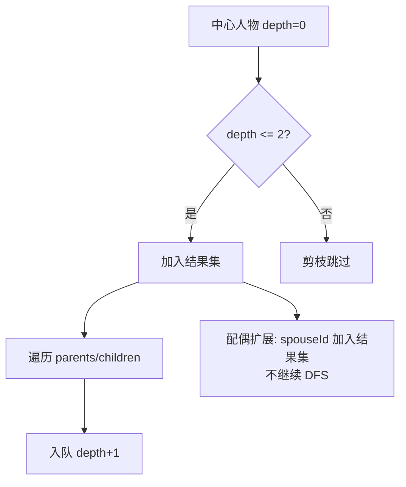

# 技术设计文档：智能导出过滤器 & 配偶关系重构

## 概述

本文档描述 ClanGraph 家谱应用两项新功能的技术设计：

**功能一：智能数据导出过滤器**
在现有 `exportToJSON` 基础上，新增"亲友分享"模式。用户可指定中心人物，系统通过 DFS 提取上下各 2 代血亲（含配偶），并按字段维度勾选对数据进行清洗后导出。

**功能二：配偶关系逻辑重构**
在 `Person` 模型中引入显式 `spouseId` 字段，新增 `addSpouse` 原子操作（含互指、子女继承、唯一性检查），并在 `PersonDetailsSidebar` 中提供"添加配偶"入口。绘图层 `GalaxyPainter` 不做任何修改。

---

## 架构

### 整体分层

```
┌─────────────────────────────────────────────────────┐
│                     UI 层                            │
│  ExportDialog  ShareConfigPage  PersonDetailsSidebar │
└────────────────────────┬────────────────────────────┘
                         │ 调用
┌────────────────────────▼────────────────────────────┐
│                   业务逻辑层                          │
│   FamilyController (addSpouse / exportToJSON)        │
│   DfsExtractor          ExportFilter                 │
└────────────────────────┬────────────────────────────┘
                         │ 读写
┌────────────────────────▼────────────────────────────┐
│                   数据模型层                          │
│   Person (+ spouseId)   GiftRecord                   │
│   ExportConfig          ExportDimension              │
└─────────────────────────────────────────────────────┘
```

### 新增文件清单

| 文件路径 | 说明 |
|---|---|
| `lib/models/export_config.dart` | 导出配置数据类（维度枚举 + ExportConfig） |
| `lib/services/dfs_extractor.dart` | DFS 亲属范围提取算法 |
| `lib/services/export_filter.dart` | 字段清洗与 JSON 序列化 |
| `lib/widgets/export_dialog.dart` | 导出模式选择对话框 |
| `lib/widgets/share_config_page.dart` | 亲友分享配置页 |

### 修改文件清单

| 文件路径 | 修改内容 |
|---|---|
| `lib/models/person.dart` | 新增 `spouseId` 字段，更新 `toMap` / `fromMap` |
| `lib/controllers/family_controller.dart` | 新增 `addSpouse` 方法 |
| `lib/widgets/person_details_sidebar.dart` | 新增"添加配偶"按钮及回调 |
| `lib/views/family_tree_view.dart` | 接入 ExportDialog，传递 `onAddSpouse` 回调 |

---

## 组件与接口

### DfsExtractor

纯函数组件，无状态，接受完整人员 Map 和配置，返回提取结果集合。

```dart
class DfsExtractor {
  /// 以 [centerId] 为起点，沿血亲关系 DFS，
  /// 提取代际距离 <= [maxGenerations] 的所有 Person，
  /// 并将每位血亲的直接配偶一并纳入。
  static Set<String> extract({
    required Map<String, Person> people,
    required String centerId,
    int maxGenerations = 2,
  });
}
```

**算法逻辑：**

1. 初始化队列 `[(centerId, 0)]`，visited 集合，result 集合
2. 出队 `(id, depth)`：
   - 若 `depth > maxGenerations`，跳过（剪枝）
   - 将 id 加入 result
   - 遍历 `person.parents`：若未访问且 `depth + 1 <= maxGenerations`，入队 `(parentId, depth + 1)`
   - 遍历 `person.children`：若未访问且 `depth + 1 <= maxGenerations`，入队 `(childId, depth + 1)`
3. 配偶扩展（姻亲剪枝）：对 result 中每个血亲，若其 `spouseId` 非空，将配偶加入 result，**但不以配偶为起点继续 DFS**（这是姻亲剪枝的关键）



### ExportFilter

纯函数组件，根据 `ExportConfig` 对 Person 集合执行字段清洗并序列化。

```dart
class ExportFilter {
  /// 对 [people] 中的每个 Person 按 [config] 清洗字段，
  /// 返回与 exportToJSON 格式兼容的 JSON 字符串。
  static String filter({
    required Iterable<Person> people,
    required ExportConfig config,
  });
}
```

**字段维度映射：**

| 维度 | 对应字段 | 未勾选时的清洗值 |
|---|---|---|
| 基本信息 | `name`, `relationship`, `gender` | `""` |
| 礼金记录 | `giftHistory` | `[]` |
| 亲缘关系 | `parents`, `children`, `spouseId` | `[]` / `null` |
| 备注 | `bio` | `""` |

输出格式：`{"members": [...]}` — 与现有 `exportToJSON` 完全一致。

### ExportDialog

模态对话框，提供两个选项：

```dart
class ExportDialog extends StatelessWidget {
  final FamilyController controller;
  // 显示两个选项：完整备份 / 亲友分享
  // 完整备份 → 调用 controller.exportToJSON() 并复制到剪贴板
  // 亲友分享 → Navigator.push ShareConfigPage
}
```

### ShareConfigPage

全屏配置页，包含：
- 四个 `Checkbox`（基本信息默认勾选、亲缘关系默认勾选、礼金记录默认不勾选、备注默认不勾选）
- 搜索框（实时模糊匹配 `name` / `relationship`）
- 已选中心人物展示区
- "开始导出"按钮（无中心人物时禁用）

```dart
class ShareConfigPage extends StatefulWidget {
  final FamilyController controller;
}
```

### FamilyController.addSpouse

```dart
/// 为 [personId] 添加配偶。
/// 若 personId 已有 spouseId，先弹出确认对话框（由调用方处理）。
/// 原子操作：互指 spouseId + 子女继承 + saveToDisk
void addSpouse(
  String personId,
  String name,
  String relationship,
  String bio,
  String gender,
);
```

---

## 数据模型

### Person（更新）

```dart
class Person {
  final String id;
  final String name;
  final String relationship;
  final String gender;
  final String bio;
  final List<String> parents;
  final List<String> children;
  final String? spouse;    // 保留，向后兼容
  final String? spouseId;  // 新增，显式配偶 ID
  final List<GiftRecord> giftHistory;
}
```

**序列化规则：**
- `toMap()` 新增键 `"spouseId"`
- `fromMap()` 读取 `map['spouseId']`，缺失或空值时为 `null`
- 旧数据（无 `spouseId` 键）加载后 `spouseId` 为 `null`，`spouse` 字段正常读取，保持向后兼容

### ExportConfig

```dart
enum ExportDimension { basicInfo, giftHistory, relations, bio }

class ExportConfig {
  final Set<ExportDimension> enabledDimensions;
  final String centerId;

  const ExportConfig({
    required this.enabledDimensions,
    required this.centerId,
  });

  // 默认配置：基本信息 + 亲缘关系
  static ExportConfig defaultConfig(String centerId) => ExportConfig(
    enabledDimensions: {ExportDimension.basicInfo, ExportDimension.relations},
    centerId: centerId,
  );
}
```

---

## 正确性属性

*属性（Property）是在系统所有合法执行路径上都应成立的特征或行为——本质上是对系统应做什么的形式化陈述。属性是人类可读规范与机器可验证正确性保证之间的桥梁。*

### 属性 1：DFS 代际距离不变量

*对于任意* 家谱数据集和任意中心人物，DfsExtractor 提取结果中的每个 Person，其到中心人物的最短血亲路径长度均不超过 2。（4.1 和 4.8 合并；4.2、4.3、4.4、4.6 作为边界用例由本属性覆盖）

**验证需求：4.1, 4.8**

### 属性 2：血亲配偶纳入结果

*对于任意* 家谱数据集和任意中心人物，DfsExtractor 提取结果中，每个血亲范围内 Person 的直接配偶（`spouseId` 非空）均应出现在结果集中。

**验证需求：4.5**

### 属性 3：配偶扩展不传播 DFS

*对于任意* 家谱数据集，DfsExtractor 提取结果中，仅通过配偶关系纳入的 Person（其本身不在 2 代血亲范围内），其 `parents` 和 `children` 不应因此被加入结果集（除非这些血亲本身也在 2 代血亲范围内）。

**验证需求：4.7**

### 属性 4：ExportFilter 字段清洗正确性

*对于任意* Person 集合和任意 ExportConfig，ExportFilter.filter 输出的每个 Person 对象中，未勾选维度对应的字段值应为空值（`""`、`[]` 或 `null`），已勾选维度对应的字段值应与原始数据一致。（2.2、2.3、5.2 合并）

**验证需求：2.2, 2.3, 5.2**

### 属性 5：ExportFilter 输出合法 JSON

*对于任意* ExportConfig 组合，ExportFilter.filter 的输出均可被标准 JSON 解析器成功解析，且顶层结构包含 `members` 数组。（2.5 和 5.3 合并）

**验证需求：2.5, 5.3**

### 属性 6：ExportFilter 幂等性

*对于任意* Person 集合和任意 ExportConfig，对同一集合执行两次 ExportFilter.filter，两次结果应完全相同。

**验证需求：5.4**

### 属性 7：ExportFilter 范围隔离

*对于任意* DfsExtractor 提取的 Person 集合，ExportFilter 序列化输出的 `members` 数组中，不包含提取范围之外的 Person。

**验证需求：5.1**

### 属性 8：Person 序列化往返

*对于任意* Person 对象 `p`（包含任意 `spouseId` 值），执行 `Person.fromMap(p.toMap())` 后，结果对象的所有字段（包括 `spouseId`）均与原始对象等价。（6.2、6.3 作为边界用例由本属性覆盖）

**验证需求：6.4**

### 属性 9：配偶互指不变量

*对于任意* 执行 `addSpouse(A, ...)` 创建配偶 B 后的状态，A 的 `spouseId` 等于 B 的 `id`，且 B 的 `spouseId` 等于 A 的 `id`。（8.1 和 8.3 合并）

**验证需求：8.1, 8.3**

### 属性 10：子女继承属性

*对于任意* 执行 `addSpouse(A, ...)` 创建配偶 B 后的状态，A 的每个子女 `c` 的 `parents` 列表包含 B 的 `id`，且 B 的 `children` 列表包含 `c` 的 `id`。（8.2 和 8.4 合并）

**验证需求：8.2, 8.4**

---

## 错误处理

| 场景 | 处理方式 |
|---|---|
| `addSpouse` 时 personId 已有 `spouseId` | 由 UI 层（PersonDetailsSidebar）弹出确认对话框，用户确认后才调用 controller |
| DfsExtractor 中心人物 ID 不存在 | 返回空集合 |
| ExportFilter 输入空集合 | 返回 `{"members":[]}` |
| 搜索框无匹配结果 | 禁用"开始导出"按钮，展示"无匹配结果"提示 |
| JSON 序列化异常 | 捕获异常，向用户展示错误 SnackBar |

---

## 测试策略

### 双轨测试方法

**单元测试**（具体示例与边界条件）：
- `DfsExtractor`：空图、单节点、只有配偶无子女、代际恰好为 2 的边界节点
- `ExportFilter`：所有维度勾选、所有维度不勾选、空 Person 集合
- `Person.fromMap / toMap`：旧格式数据（无 `spouseId` 键）的向后兼容加载
- `addSpouse`：已有配偶时的替换流程

**属性测试**（普遍性验证，使用 [dart_test](https://pub.dev/packages/test) + [fast_check](https://pub.dev/packages/fast_check) 或手写生成器）：

每个属性测试最少运行 100 次迭代。每个测试用注释标注对应属性：

```
// Feature: smart-export-and-spouse-relation, Property 1: DFS 代际距离不变量
```

| 属性 | 测试方法 | 生成器 |
|---|---|---|
| 属性 1 | 生成随机家谱 + 随机中心人物，验证所有结果节点距离 ≤ 2 | 随机 Person 图 |
| 属性 2 | 生成含配偶的家谱，验证每个血亲的配偶都在结果集中 | 含配偶的随机图 |
| 属性 3 | 生成含配偶血亲分支的家谱，验证配偶的血亲不在结果中 | 含姻亲的随机图 |
| 属性 4 | 生成随机 Person 集合 + 随机 ExportConfig，验证字段清洗正确性 | 随机 ExportConfig |
| 属性 5 | 生成随机 ExportConfig，验证输出可被 `json.decode` 解析且含 `members` | 随机 ExportConfig |
| 属性 6 | 生成随机 Person 集合 + 随机 ExportConfig，执行两次 filter 比较结果 | 随机 ExportConfig |
| 属性 7 | 生成随机图，提取后过滤，验证输出不含范围外节点 | 随机家谱图 |
| 属性 8 | 生成随机 Person（含任意 spouseId），验证往返等价 | 随机 Person |
| 属性 9 | 调用 addSpouse 后验证双向 spouseId 互指 | 随机 Person 对 |
| 属性 10 | 调用 addSpouse 后验证子女 parents 和配偶 children 的一致性 | 随机含子女的 Person |
