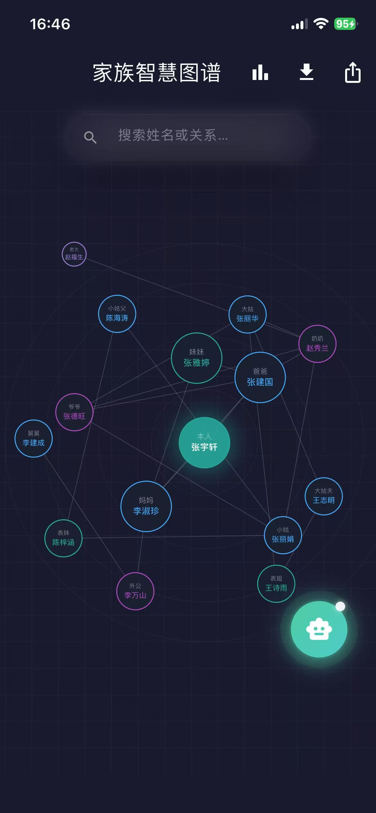
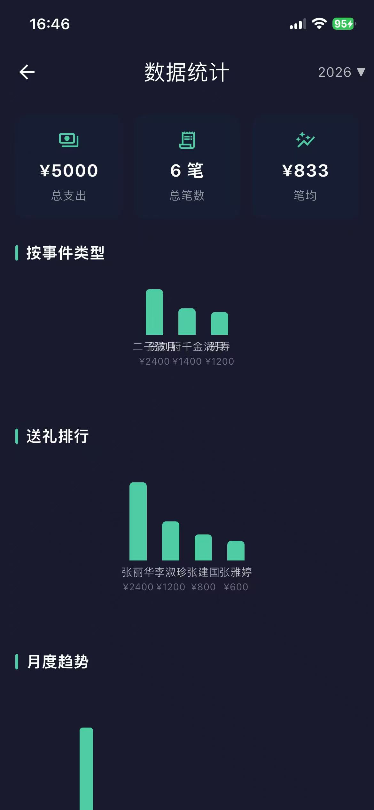
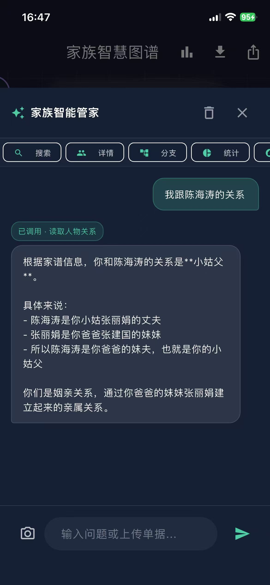

<div align="center">

# ⛩️ ClanGraph · 家族智慧图谱

*重建有温度的家族连接，让每一份人情都有迹可循*

[](https://flutter.dev)
[](https://open.bigmodel.cn)
[]()
[](LICENSE)

[🌐 在线体验](https://cerfh.github.io/ClanGraph/) · [📥 下载代码](https://github.com/CerfH/ClanGraph/archive/refs/heads/main.zip)

</div>

---

## 📸 项目展示

<div align="center">

|  |  |  |  |
|:---:|:---:|:---:|:---:|
| 家族图谱 | 统计看板 | AI 对话 | 礼单识别 |

</div>

---

## 📖 项目背景

在中国乡土社会中，家族关系与人情往来是日常社交的核心。然而随着家族规模扩大和代际更替，三个痛点日益突出：

> **亲属称谓难以准确记忆**、**人情礼金缺乏系统记录**、**家族关系脉络梳理不清**

市面上现有的家谱工具往往只提供静态的树状图展示，缺乏交互性和智能性；通用记账工具则无法体现人情往来中的亲疏关系和礼尚往来的文化语境。

ClanGraph 正是为解决这些不足而设计——将家族成员及其关系结构化存储为可计算的知识图谱，并接入大语言模型的推理与工具调用能力，为用户提供一个既能可视化家族全貌、又能通过自然语言对话完成查询、建议和录入的智能助手。

---

## ✨ 核心功能

### 🕸️ 家族图谱可视化

用户通过表单添加家族成员（姓名、性别、与现有成员的关系），系统自动完成以下计算与呈现：

- **辈分层级推导**：以当前中心人物为原点，通过广度优先遍历计算每位成员所处的代际位置，自动区分祖辈、父辈、同辈、子辈等层级
- **亲疏量化**：结合血缘距离与代际差，将亲疏关系映射为节点圆圈的物理大小——血缘越近、节点越大
- **辈分着色**：不同辈分使用不同颜色标识，暖色系为长辈、冷色系为晚辈，当前中心人物高亮，一目了然
- **视角切换**：点击任意成员可将其设为新的图谱中心，所有关系脉络实时重算重绘——例如从"以我为中心"切换为"以父亲为中心"，即可查看父系家族的全貌

图谱采用分层涟漪式布局：以中心人物为锚点，直系亲属分布于内环，旁系亲属向外扩散，自动避让重叠，确保可读性。

### 💰 人情礼金管理

针对中国家庭中常见的随礼场景，提供完整的礼金记录管理能力：

- 为每位成员添加多条礼金记录，每笔记录包含**事件类型**（如结婚、满月、乔迁、春节、生日等）、**金额**和**日期**
- 礼金记录与成员绑定，切换中心人物后可追溯任意家族分支的人情往来
- **统计看板**：按年度展示礼金总额、笔数和均值，提供月度趋势柱状图和事件类型分布饼图，直观呈现人情开支结构
- 事件类型从历史数据中动态提取，无需手动维护分类列表

### 🤖 AI 智能助手

本项目的核心亮点——AI 不是简单的聊天机器人，而是一个具备**本地工具调用能力**的 Agent。接入智谱 AI 双引擎：

| 模型 | 用途 |
|------|------|
| `GLM-4.5-air` | 文本理解、逻辑推理、工具调用决策 |
| `GLM-4.6V` | 多模态视觉识别（手写礼单 OCR） |

#### 🔧 工具调用系统

AI 助手被赋予了 7 个可直接操作家族数据的本地工具，模型会根据用户意图自主判断应调用哪个工具、以什么参数调用：

| 工具 | 触发场景示例 |
|------|-------------|
| 搜索家族成员 | "帮我找一下姓王的都有谁" |
| 查看成员详情 | "看看我舅舅的完整信息" |
| 展开家族分支 | "外公那边有哪些亲戚？" |
| 统计礼金往来 | "今年总共随了多少礼？" |
| 切换图谱中心 | "切换到以爸爸为中心" |
| 推荐礼金金额 | "表哥结婚该随多少钱？" |
| 对话式添加成员 | "帮我把我二叔黄建军加进来" |

系统支持多轮工具调用：模型可以在一次回答中连续调用多个工具（例如先搜索成员定位 ID，再查详情），最多支持 4 轮工具调用循环，确保复杂查询被充分拆解和执行。

#### 👁️ 多模态礼单识别

用户可拍照或从相册选取手写礼单图片，系统自动完成以下流程：

1. 图片压缩至 1024px 宽度、70% 质量，减少传输体积
2. 通过 `GLM-4.6V` 视觉模型提取结构化信息（姓名、金额、事件、日期）
3. 与现有家族成员进行姓名模糊匹配，自动关联或标记为新成员
4. 支持多图并发识别与自动去重，结果可一键导入礼金记录

#### 🧮 礼金推荐算法

当用户询问"该随多少钱"时，系统执行以下推理链：

1. 检索全家族历史礼金记录，按事件类型模糊匹配
2. 通过 BFS 计算送礼对象与当前中心人物的血缘距离
3. 将近亲（2 步以内）的历史礼金均值作为参考基准
4. 返回推荐区间（均值 × 0.8 ~ × 1.3）、历史最低/最高值、近期同类事件案例

### 🖼️ 图谱图片导出

通过 `RepaintBoundary` 截取当前图谱画布，导出为高清图片并保存至系统相册，便于通过微信等渠道分享给家人核对、补充信息。

---

## 🔒 隐私设计

ClanGraph 遵循本地优先的设计原则：

- **数据本地存储**：所有家族成员信息、礼金记录均以 JSON 格式序列化后存储于设备本地 `SharedPreferences` 中，不经过任何中转服务器
- **按需传输**：仅在与 AI 进行对话时，将回答所需的家族成员上下文（姓名、关系、礼金记录）作为对话 prompt 的一部分发送至智谱模型服务器；视觉识别时仅传输压缩后的图片数据。传输完成后不在服务端持久化
- **零采集**：应用不集成任何第三方数据统计 SDK、用户行为追踪 SDK 或崩溃上报 SDK，无网络权限滥用

---

## 🚀 快速开始

### 环境要求

- Flutter SDK >= 3.11.0
- 智谱 AI API Key（[免费申请](https://open.bigmodel.cn)，新用户赠送试用额度）

### 安装与运行

```bash
git clone https://github.com/CerfH/ClanGraph.git
cd ClanGraph
flutter pub get
```

在项目根目录创建 `.env` 文件，填入以下配置：

```env
ZHIPU_API_KEY=你的API_Key
ZHIPU_BASE_URL=https://open.bigmodel.cn/api/paas/v4/
ZHIPU_MODEL_TEXT=glm-4.5-air
ZHIPU_MODEL_VISION=glm-4.6v
```

```bash
flutter run
```

> 未配置 API Key 时仍可正常使用图谱构建与礼金管理功能，AI 对话与图片识别功能不可用。

---

## 📄 License

本项目采用 MIT 开源协议，详见 [LICENSE](LICENSE)。

---

<div align="center">

*为中华家族文化而生 ⛩️*

</div>
